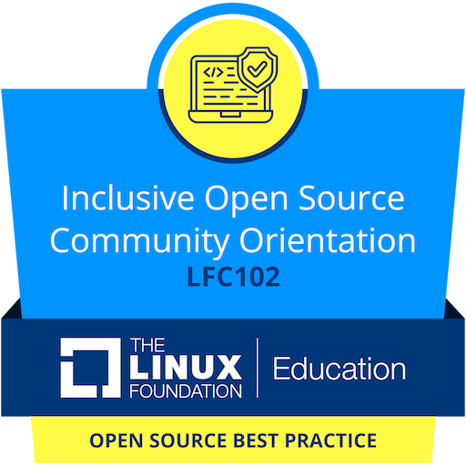
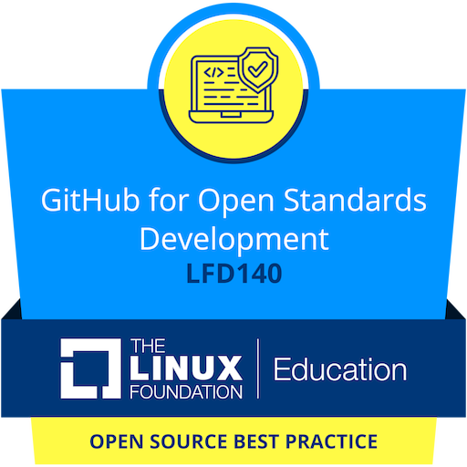
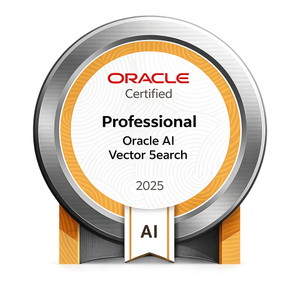
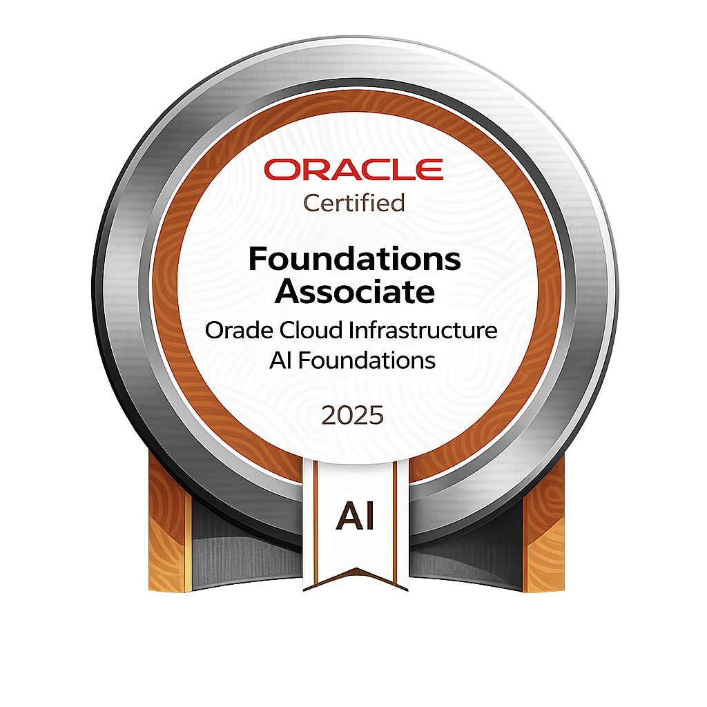
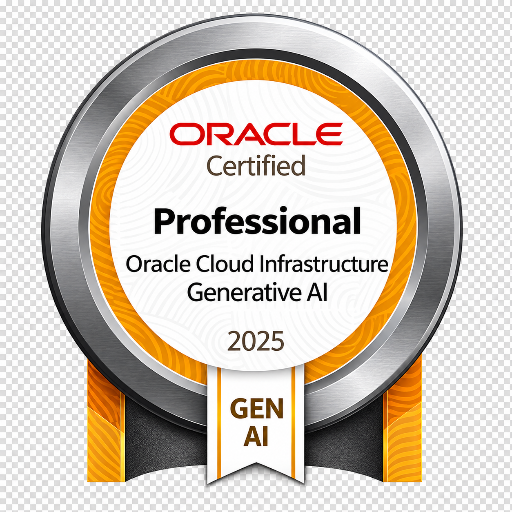

# Hey, I'm Pranav Thawait

### AI/ML Engineer · Full-Stack Developer · Open-Source Builder

<p align="left">
  <a href="https://www.linkedin.com/in/pranav-thawait-140a092b2/">
    
  </a>
  <a href="https://github.com/Pranav00076">
    
  </a>
  <a href="mailto:pranavthawait@gmail.com">
    
  </a>
</p>

---

## About Me

I'm a **Computer Science student specializing in AI/ML** at Newton School of Technology, passionate about building software that combines **AI, modern web technologies, and real-world systems**.

I enjoy going beyond tutorials and building things from scratch — from **RAG systems and local LLM applications** to **real-time collaborative platforms, developer tools, and open-source products**.

Currently, I'm focused on:

-  AI/LLM applications
-  Retrieval-Augmented Generation (RAG)
-  AI agents & automation
-  Full-stack web applications
-  Real-time systems & WebSockets
-  Developer tools & open-source software
-  Building and shipping products

I'm also a **Co-Founder of Omnikon**, an open-source organization focused on developer tools, educational content, documentation, community programs, and contributor growth.

---

##  What I Build

```text
AI Systems
├── RAG Applications
├── Local LLMs
├── AI Agents
├── LLM Integrations
└── AI Automation

Software Systems
├── Full-Stack Applications
├── Real-Time Systems
├── WebSocket Applications
├── Developer Tools
└── APIs & Backend Systems

Open Source
├── Developer Libraries
├── Community Projects
├── Open-Source Products
└── Collaborative Development
```

---

#  Tech Stack

### Languages

<p>
  
</p>

### Frontend

<p>
  
</p>

### Backend & Databases

<p>
  
</p>

### AI / ML / GenAI

**RAG · LangChain · Embeddings · Vector Search · LLM Applications · AI Agents · Prompt Engineering · Local LLMs · Ollama · Qwen · OpenAI API · OpenRouter · Groq · ChromaDB**

### Tools & DevOps

<p>
  
</p>

**Git · GitHub · Docker · CI/CD · REST APIs · WebSockets · Vercel**

---

#  Featured Projects

##  DriveLoader

### Google Drive → React Media Library

**`@driveloader/react`**

A developer-focused React library for working with Google Drive-hosted media.

**Highlights**

- 📦 Published as an NPM package
-  React + TypeScript
-  Google Drive media integration
-  Smart URL resolution
-  Media loading & caching
-  Developer documentation
-  Built as an open-source developer tool

**NPM:**  
https://www.npmjs.com/package/@driveloader/react

**Repository:**  
https://github.com/Omnikon-Org/driveLoader

---

##  ConferAI

### Real-Time AI Meeting Assistant

A real-time conferencing platform combining **WebSockets, audio streaming and AI transcription**.

**Tech:**  
`Next.js` · `React` · `Node.js` · `WebSockets` · `Deepgram` · `Firebase`

**Highlights**

-  Real-time audio streaming
-  Live AI transcription
-  WebSocket-based communication
-  Multi-device / microphone synchronization
-  Speaker identification
-  Hindi-English code switching
-  Firebase authentication
-  Transcript persistence & export
-  PWA support

**Repository:**  
https://github.com/Pranav00076/ConferAI

---

##  Local AI

### Private Local RAG Assistant

A local-first Retrieval-Augmented Generation system designed to answer questions over private documents without relying on external AI APIs.

**Tech:**  
`Python` · `Ollama` · `Qwen` · `LangChain` · `ChromaDB`

**Pipeline**

```text
Documents
    ↓
Ingestion
    ↓
Chunking
    ↓
Embeddings
    ↓
Vector Database
    ↓
Semantic Retrieval
    ↓
Qwen / Ollama
    ↓
Contextual Answer
```

**Highlights**

-  Local/private inference
-  Retrieval-Augmented Generation
-  Document ingestion
-  Semantic search
-  Embedding-based retrieval
-  Local Qwen inference
-  Persistent vector storage

**Repository:**  
https://github.com/Pranav00076/Local-AI

---

##  SyncCanvas

### AI-Powered Real-Time Collaborative Whiteboard

An open-source collaborative whiteboard built around real-time synchronization.

**Tech:**  
`React` · `TypeScript` · `Fabric.js` · `Node.js` · `Express` · `WebSockets` · `Yjs` · `OpenRouter`

**Highlights**

-  Infinite collaborative canvas
-  Real-time multiplayer synchronization
-  Live cursors
-  Shapes, text & sticky notes
-  CRDT-based synchronization
-  WebSocket communication
-  Private rooms
-  Local/WiFi rooms
-  AI mind-map generation
-  Canvas export

---

##  AI Business Automation Suite

### LLM-Powered Workflow Automation

An AI automation system designed to connect LLMs with business workflows.

**Tech:**  
`n8n` · `OpenAI API` · `Groq` · `Airtable` · `Gmail API` · `Slack API`

**Highlights**

-  AI lead qualification
-  Lead scoring
-  Automated email generation
-  Slack notifications
-  CRM updates
-  AI content generation
-  Human-in-the-Loop approval workflows

---

#  Omnikon

### Co-Founder · Open-Source Organization

I'm a Co-Founder of **Omnikon**, a student-led open-source technology organization focused on building software, developer tools and community-driven projects.

My work includes:

- Managing repositories
- Reviewing pull requests
- Building documentation
- Creating developer roadmaps
- Maintaining open-source projects
- Building software products
- Supporting contributor growth
- Community initiatives
- Technical events & hackathons

### Omnikon

🌐 https://omnikonhub.com/

💻 https://github.com/Omnikon-Org

---

#  Open Source

I enjoy building in public and contributing to open-source projects.

Areas I contribute to:

-  React / TypeScript
-  Full-stack development
-  AI/LLM applications
-  Real-time systems
-  Developer tooling
-  NPM libraries
-  Documentation
-  CI/CD & deployment

I'm especially interested in projects where **software engineering meets AI and developer experience**.

---

#  AI / GenAI Interests

I'm particularly interested in the engineering side of modern AI systems:

```text
LLMs
 │
 ├── RAG
 │   ├── Embeddings
 │   ├── Vector Search
 │   └── Semantic Retrieval
 │
 ├── Agents
 │   ├── Tool Calling
 │   ├── Planning
 │   └── Automation
 │
 ├── Local AI
 │   ├── Ollama
 │   └── Qwen
 │
 └── AI Applications
     ├── Real-Time AI
     ├── Developer Tools
     └── Workflow Automation
```

---

#  Certifications

### Oracle

- **Oracle Cloud Infrastructure 2025 Certified Generative AI Professional**
- **Oracle AI Vector Search Certified Professional**

### The Linux Foundation

- **LFX Open Source Community Orientation**
- **LFX GitHub for Open Standards Development**

---
### Badges

<p align="center" >

[](https://www.credly.com/badges/2d9fc653-5909-468b-8bd4-3c77bd147153/public_url)
&nbsp;&nbsp;&nbsp;&nbsp;&nbsp;&nbsp;&nbsp;&nbsp;&nbsp;
[](https://www.credly.com/badges/7b073889-08c9-4a55-a09a-1d213809447f/public_url)
&nbsp;&nbsp;&nbsp;&nbsp;&nbsp;&nbsp;
[](https://catalog-education.oracle.com/ords/certview/sharebadge?id=D4A709CEDDF5DBE2294BF800A7BFCE0E7B7D6AE09F8E012BB1B756AFCA491A35)
&nbsp;&nbsp;&nbsp;
[](https://catalog-education.oracle.com/ords/certview/sharebadge?id=99CFC74D35439D6E14E20A7FCB6CC00BA6D995486CD55599F63CE68FFCA9BBB4)
&nbsp;&nbsp;&nbsp;
[](https://catalog-education.oracle.com/ords/certview/sharebadge?id=18DF72FDDB26A58F948D8770230C380797608D87F26104CF561F4A0AA9C2F6BB)

</p>

---

#  Education

### Newton School of Technology

**B.Tech — Computer Science & Engineering (AI/ML)**

`2025 – 2029`

**CGPA: 9.4 / 10**

---

#  GitHub Stats

<p align="center">
  
  
</p>

---

#  Contribution Streak

<p align="center">
  
</p>

---

#  Let's Connect

I'm always interested in:

-  AI/ML projects
-  GenAI & RAG
-  Full-stack engineering
-  Open-source collaboration
-  Developer tools
-  Hackathons
-  Experimental projects

If you're building something interesting, feel free to reach out.

<p>
  <a href="https://www.linkedin.com/in/pranav-thawait-140a092b2/">
    
  </a>
  <a href="mailto:pranavthawait@gmail.com">
    
  </a>
</p>

---

<p align="center">
  <i>Building. Learning. Shipping. Contributing.</i>
</p>
